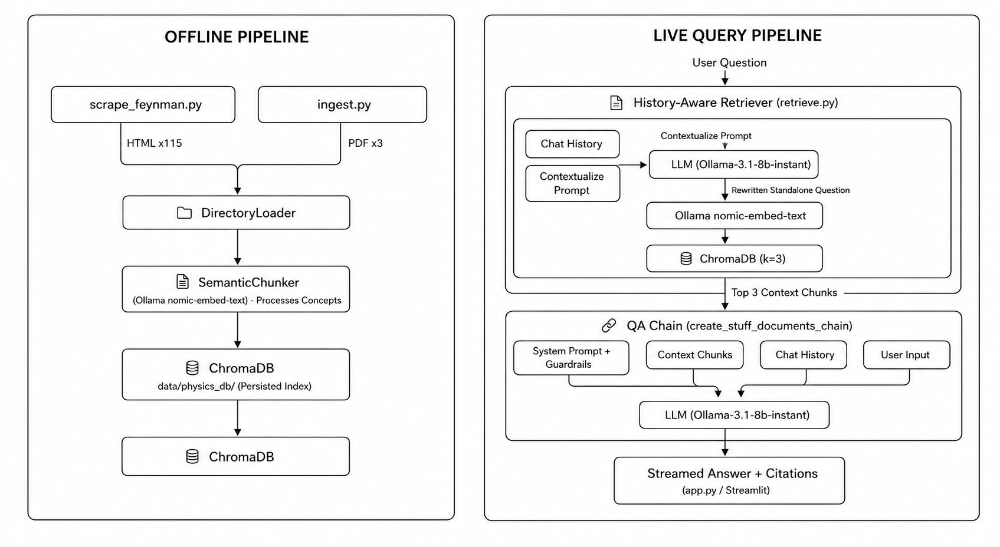

# ✨ Physics Oracle — RAG Chatbot

A **Retrieval-Augmented Generation (RAG)** chatbot that answers undergraduate physics questions using The Feynman Lectures and OpenStax University Physics textbooks as its knowledge base. Powered by a local Ollama embedding model and Groq's LLaMA 3.1 inference API, with a polished Streamlit chat interface.

**Guardrail precision: 100% (20/20 tests passed)**

---

## Architecture





---

## Corpus

The knowledge base comprises **three sources** totalling ~200 MB of physics content:

### The Feynman Lectures on Physics (HTML)
Scraped directly from [feynmanlectures.caltech.edu](https://www.feynmanlectures.caltech.edu) using `scrape_feynman.py`.

| Volume | Chapters | Topics Covered |
|--------|----------|----------------|
| Volume I (`I_01` – `I_52`) | 52 | Mechanics, Thermodynamics, Waves, Oscillations |
| Volume II (`II_01` – `II_42`) | 42 | Electromagnetism, Maxwell's Equations, Optics |
| Volume III (`III_01` – `III_21`) | 21 | Quantum Mechanics |
| **Total** | **115 chapters** | |

### OpenStax University Physics (PDF)
Three open-access textbooks covering undergraduate curriculum:

| File | Coverage |
|------|----------|
| `university-physics-volume-1_-_WEB.pdf` | Mechanics, Waves (~81 MB) |
| `university-physics-volume-2_-_WEB.pdf` | Thermodynamics, Electricity & Magnetism (~64 MB) |
| `university-physics-volume-3_-_WEB.pdf` | Optics, Modern Physics, Quantum (~53 MB) |

> **Dev Mode:** `ingest.py` has a `DEV_MODE = True` flag that limits ingestion to 20 documents for rapid iteration. Set to `False` for a full production build.

---

## Project Structure

```
physics-rag-chatbot/
├── data/
│   ├── raw/
│   │   ├── I_01.html … I_52.html       # Feynman Vol. I
│   │   ├── II_01.html … II_42.html     # Feynman Vol. II
│   │   ├── III_01.html … III_21.html   # Feynman Vol. III
│   │   ├── university-physics-volume-1_-_WEB.pdf
│   │   ├── university-physics-volume-2_-_WEB.pdf
│   │   └── university-physics-volume-3_-_WEB.pdf
│   └── physics_db/                     # ChromaDB vector store (auto-generated)
├── src/
│   ├── scrape_feynman.py               # One-time HTML corpus downloader
│   ├── ingest.py                       # Chunking + embedding + DB builder
│   ├── retrieve.py                     # RAG pipeline (retriever + LLM chain)
│   ├── app.py                          # Streamlit chat UI
│   └── test_hallucinations.py          # 20-question guardrail test suite
├── .env                                # API keys (not committed)
└── requirements.txt
```

---

## Prerequisites

| Requirement | Version | Purpose |
|-------------|---------|---------|
| Python | 3.10 + | Runtime |
| [Ollama](https://ollama.com) | Latest | Local embedding model |
| Groq API Key | — | LLM inference |

---

## Deployment Instructions

### 1. Clone & Set Up Environment

```bash
git clone https://github.com/your-username/physics-rag-chatbot.git
cd physics-rag-chatbot

python -m venv venv
# Windows
venv\Scripts\activate
# macOS / Linux
source venv/bin/activate
```

### 2. Install Dependencies

```bash
pip install streamlit langchain langchain-core langchain-groq langchain-chroma \
            langchain-experimental langchain-community langchain-ollama \
            chromadb sentence-transformers pypdf bs4 python-dotenv tqdm cloudscraper
```

> **Note:** `langchain-community` is deprecated. The imports in `retrieve.py` and `ingest.py` that use it should be migrated:
> ```python
> # Old (deprecated)
> from langchain_community.vectorstores import Chroma
> from langchain_community.embeddings import OllamaEmbeddings
>
> # New (recommended)
> from langchain_chroma import Chroma
> from langchain_ollama import OllamaEmbeddings
> ```

### 3. Pull the Ollama Embedding Model

```bash
ollama pull nomic-embed-text
```

Verify Ollama is running before proceeding:

```bash
ollama list   # should show nomic-embed-text
```

### 4. Configure Environment Variables

Create a `.env` file in the project root:

```env
GROQ_API_KEY=your_groq_api_key_here
```

Get a free Groq API key at [console.groq.com](https://console.groq.com).

### 5. Download the Corpus

**Option A — Feynman Lectures (HTML scraper):**

```bash
cd src
python scrape_feynman.py
```

This downloads all 115 chapters (~50 MB) to `data/raw/`. It includes a 2-second delay between requests to be polite to the server.

**Option B — OpenStax PDFs:**

Download manually from [openstax.org/subjects/science](https://openstax.org/subjects/science) and place the three PDF files in `data/raw/`.

### 6. Build the Vector Database

```bash
cd src
python ingest.py
```

> For a quick test run, leave `DEV_MODE = True` in `ingest.py` (processes 20 documents in ~2 minutes).  
> For the full corpus, set `DEV_MODE = False` (may take 30–60 minutes depending on hardware).

The ChromaDB database is saved to `data/physics_db/`.

### 7. Launch the App

```bash
cd src
streamlit run app.py
```

Open [http://localhost:8501](http://localhost:8501) in your browser.

---

## Running the Guardrail Test Suite

```bash
cd src
python test_hallucinations.py
```

The suite fires 20 questions (10 physics, 10 out-of-scope) and validates that the system answers physics questions and firmly refuses everything else.

```
--- EVALUATION COMPLETE ---
Total Questions:    20
Passed Guardrails: 20
System Precision:  100.0%
```

---

## How It Works

1. **Scrape** — `scrape_feynman.py` pulls all 115 Feynman Lecture HTML chapters via `cloudscraper`.
2. **Ingest** — `ingest.py` loads HTML + PDFs, runs `SemanticChunker` (using Ollama embeddings to split on meaning, not fixed token counts), and stores vectors in ChromaDB.
3. **Retrieve** — On each query, `retrieve.py` builds a two-stage LangChain pipeline:
   - **Stage 1 — Contextualize:** Groq LLaMA rewrites any follow-up question into a fully self-contained query using chat history.
   - **Stage 2 — QA:** The rewritten query hits ChromaDB (top-3 chunks), then those chunks + history are passed to LLaMA with a strict system prompt that enforces physics-only scope.
4. **Stream** — `app.py` streams the response token-by-token and renders source citations in an expandable panel.

---

## Guardrails

The system prompt in `retrieve.py` enforces three hard rules:

1. If the answer is not in the retrieved context → `"I don't have enough information in my textbooks to answer that."`
2. If the question is not about physics → `"I am a physics assistant and cannot answer out-of-scope questions."`
3. All answers must cite the source document.

---

## Known Issues & Fixes

| Issue | Fix |
|-------|-----|
| `ModuleNotFoundError: No module named 'langchain.chains'` | Replace `from langchain_classic.chains import ...` with `from langchain.chains import create_history_aware_retriever, create_retrieval_chain` |
| `DeprecationWarning: langchain-community is being sunset` | Migrate to `langchain-chroma` and `langchain-ollama` as shown in Step 2 |
| `Chroma` import error | `pip install langchain-chroma` then `from langchain_chroma import Chroma` |

---

## Tech Stack

| Layer | Technology |
|-------|-----------|
| UI | Streamlit |
| Orchestration | LangChain (v1.3+) |
| LLM | Groq — LLaMA 3.1 8B Instant |
| Embeddings | Ollama — nomic-embed-text (local) |
| Vector Store | ChromaDB |
| Chunking | SemanticChunker (langchain-experimental) |
| Data Sources | Feynman Lectures (HTML) + OpenStax (PDF) |

---

## License

This project is for educational purposes. The Feynman Lectures are © California Institute of Technology and are used here under their non-commercial use terms. OpenStax textbooks are CC BY 4.0.